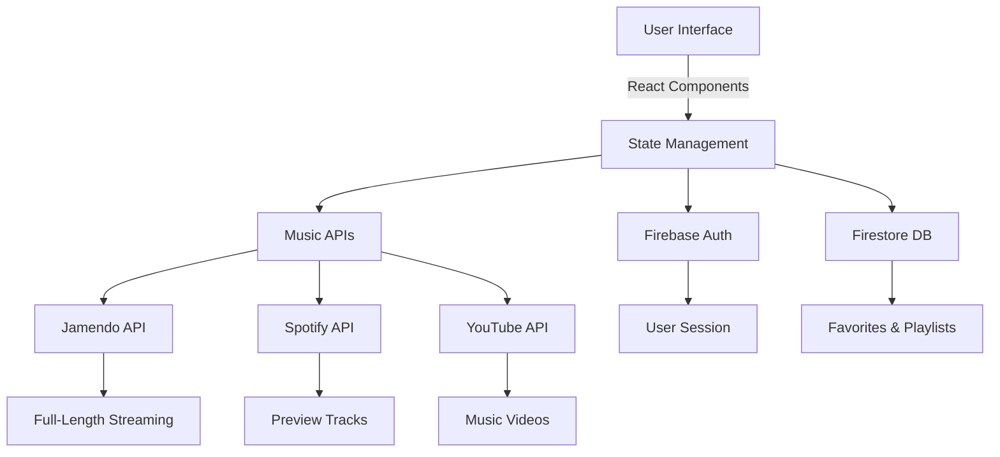

<p align="center">
  
</p>

<h1 align="center">🎵 VMusic – Indie Music Streaming Platform</h1>
<h3 align="center"><i>"Feel the Indie Beat. Free. Forever."</i></h3>

<p align="center">
  <a href="https://v-music-gamma.vercel.app/">
    
  </a>
  <a href="#-key-features">
    
  </a>
  <a href="#-how-to-contribute-woc-social">
    
  </a>
</p>


<p align="center">
  
  
  
  
  
  
</p>

---

## 📋 Table of Contents

- [About VMusic](#-about-vmusic)
- [Winter of Code Social 2025](#️-winter-of-code-social-2025)
- [Tech Stack](#-tech-stack)
- [Key Features](#-key-features)
- [Screenshots](#-screenshots)
- [Architecture Overview](#-architecture-overview)
- [Getting Started](#-getting-started)
  - [Prerequisites](#prerequisites)
  - [Installation](#installation)
  - [Environment Setup](#environment-setup)
- [How to Contribute](#-how-to-contribute-woc-social)
- [Project Structure](#-project-structure)
- [Documentation](#-documentation)
- [Roadmap](#-roadmap)
- [Team](#-team)
- [Contributors](#-contributors)
- [Support](#-support)
- [License](#-license)

---

## 🎯 About VMusic

**VMusic** is a modern, open-source indie music streaming platform that brings independent artists to the forefront. Built with cutting-edge web technologies, VMusic offers a seamless music discovery and streaming experience with full-length tracks, curated playlists, and social features—all completely free.

### 🌟 Why VMusic?

- **Support Indie Artists**: Stream directly from Jamendo's extensive indie music library
- **Discover New Music**: Spotify-powered recommendations and smart search
- **Community-Driven**: Open-source project welcoming contributions
- **Privacy-First**: Your data stays secure with Firebase authentication
- **Modern UX**: Beautiful glassmorphism design with smooth animations
- **Cross-Platform**: Responsive design works on all devices

---

## ❄️ Winter of Code Social 2025

<p align="center">
  
</p>

VMusic is proud to be part of **Winter of Code Social 2025**! We welcome students and developers to contribute during this open-source program.

<p align="center">
  <a href="https://github.com/WinterofCode"></a>
  <a href="https://discord.com/channels/1049667734025289729/1444724828379811942">
    
  </a>
</p>

### 🎁 What's in it for Contributors?

- ✅ Real-world project experience
- ✅ Mentorship from experienced developers
- ✅ Certificate of completion
- ✅ Contributor badge on your profile
- ✅ Network with fellow developers
- ✅ Build your open-source portfolio

---

## 🛠️ Tech Stack

<p align="center">
  <a href="https://react.dev/"></a>
  <a href="https://vitejs.dev/"></a>
  <a href="https://tailwindcss.com/"></a>
  <a href="https://firebase.google.com/"></a>
  <a href="https://www.framer.com/motion/"></a>
  <a href="https://vercel.com/"></a>
</p>

### 🧰 Tech Layer Overview

| Layer | Technologies | Purpose |
|-------|-------------|---------|
| **Frontend** | React 18, Vite 5, Tailwind CSS | Lightning-fast UI with modern styling |
| **Animations** | Framer Motion, Lucide React | Smooth transitions and iconography |
| **Backend** | Firebase Auth, Firestore | User management and data persistence |
| **APIs** | Jamendo, Spotify, YouTube | Music streaming and recommendations |
| **Deployment** | Vercel, Vercel Functions | Serverless hosting and API routes |
| **Email** | EmailJS | Password recovery and notifications |

---

## ✨ Key Features

### 🎵 Music Experience
- **Full-Length Streaming**: Enjoy complete indie tracks via Jamendo API
- **Vibe Zone**: Discover new music with Spotify-powered 30s previews
- **Smart Search**: Find songs, artists, and albums instantly
- **Global Player**: Persistent audio player across all pages
- **High-Quality Audio**: Stream in the best available quality

### 🔐 User Features
- **Multi-Auth Support**: Email, Google sign-in via Firebase
- **Favorites System**: Save and sync your favorite tracks
- **Personalized Playlists**: Create and manage custom playlists
- **Password Recovery**: Email-based password reset functionality
- **Profile Management**: Customize your music profile

### 🎨 Design & UX
- **Glassmorphism UI**: Modern, translucent design aesthetic
- **Smooth Animations**: Framer Motion-powered transitions
- **Dark Mode**: Easy on the eyes during late-night sessions
- **Responsive Design**: Perfect on mobile, tablet, and desktop
- **Accessibility**: WCAG-compliant for all users

### 🚀 Performance
- **Lightning Fast**: Vite-powered development and builds
- **Optimized Assets**: Lazy loading and code splitting
- **PWA Ready**: Install as a native app
- **SEO Optimized**: Better discoverability

---

## 📸 Screenshots

<details>
<summary><b>Click to view screenshots</b></summary>

### 🏠 Home Page


### 🎧 Player Interface


### 🔍 Search Results


### ❤️ Favorites


</details>

---

## 🏗️ Architecture Overview



---

## 🚀 Getting Started

### Prerequisites

Before you begin, ensure you have the following installed:

- **Node.js** (v18.0.0 or higher)
- **npm** or **yarn** package manager
- **Git** for version control
- A code editor (VS Code recommended)

### Installation

#### 1️⃣ Fork & Clone the Repository

```bash
# Fork the repo on GitHub, then clone your fork
git clone https://github.com/YOUR_USERNAME/VMusic.git
cd VMusic
```

#### 2️⃣ Install Dependencies

```bash
# Using npm
npm install

# Or using yarn
yarn install
```

#### 3️⃣ Configure Environment Variables

```bash
# Copy the example environment file
cp .env.example .env
```

Edit `.env` with your API credentials:

```env
# Jamendo API
VITE_JAMENDO_CLIENT_ID=your_jamendo_client_id

# Spotify API
VITE_SPOTIFY_CLIENT_ID=your_spotify_client_id
VITE_SPOTIFY_CLIENT_SECRET=your_spotify_client_secret

# Firebase Configuration
VITE_FIREBASE_API_KEY=your_firebase_api_key
VITE_FIREBASE_AUTH_DOMAIN=your_project.firebaseapp.com
VITE_FIREBASE_PROJECT_ID=your_project_id
VITE_FIREBASE_STORAGE_BUCKET=your_project.appspot.com
VITE_FIREBASE_MESSAGING_SENDER_ID=your_sender_id
VITE_FIREBASE_APP_ID=your_app_id

# EmailJS
VITE_EMAILJS_PUBLIC_KEY=your_emailjs_public_key
VITE_EMAILJS_SERVICE_ID=your_service_id
VITE_EMAILJS_TEMPLATE_ID=your_template_id
```

📚 **Need help?** Check [ENVIRONMENT_VARIABLES.md](/docs/ENVIRONMENT_VARIABLES.md) for detailed setup instructions.

#### 4️⃣ Run Development Server

```bash
npm run dev
```

Visit `http://localhost:5173` to see your local instance! 🎉

### Environment Setup

<details>
<summary><b>📖 How to get API keys</b></summary>

#### Jamendo API
1. Visit [Jamendo Developer Portal](https://developer.jamendo.com/)
2. Create an account and register your app
3. Copy your Client ID

#### Spotify API
1. Go to [Spotify for Developers](https://developer.spotify.com/)
2. Create a new app in the Dashboard
3. Copy Client ID and Client Secret

#### Firebase
1. Visit [Firebase Console](https://console.firebase.google.com/)
2. Create a new project
3. Enable Authentication (Email & Google)
4. Create a Firestore database
5. Copy configuration from Project Settings

#### EmailJS
1. Sign up at [EmailJS](https://www.emailjs.com/)
2. Create an email service
3. Create an email template
4. Copy Service ID, Template ID, and Public Key

</details>

---

## 🤝 How to Contribute (WOC Social)

We ❤️ contributions! Here's how you can help:

### 🎯 Contribution Workflow

```bash
# 1. Fork the repository (Click 'Fork' on GitHub)

# 2. Clone your fork
git clone https://github.com/YOUR_USERNAME/VMusic.git
cd VMusic

# 3. Create a new branch
git checkout -b feature/amazing-feature

# 4. Make your changes and commit
git add .
git commit -m "feat: add amazing feature"

# 5. Push to your fork
git push origin feature/amazing-feature

# 6. Open a Pull Request on GitHub
```

### 📝 Contribution Guidelines

- ✅ Follow the existing code style and conventions
- ✅ Write meaningful commit messages ([Conventional Commits](https://www.conventionalcommits.org/))
- ✅ Add comments for complex logic
- ✅ Test your changes thoroughly
- ✅ Update documentation if needed
- ✅ Use the PR template provided
- ✅ Be respectful and collaborative

### 🐛 Found a Bug?

1. Check if it's already reported in [Issues](https://github.com/mr-baraiya/VMusic/issues)
2. If not, create a new issue with the bug report template
3. Provide steps to reproduce, expected behavior, and screenshots

### 💡 Have an Idea?

1. Open a [Feature Request](https://github.com/mr-baraiya/VMusic/issues/new)
2. Describe your idea clearly
3. Wait for maintainer approval before starting work

### 🏆 Good First Issues

Look for issues labeled `good first issue` or `beginner-friendly` to get started!

---

## 📁 Project Structure

```
VMusic/
├── 📂 src/
│   ├── 📂 components/         # React components
│   │   ├── 📂 Auth/           # Authentication components
│   │   ├── 📂 Player/         # Music player components
│   │   ├── 📂 Search/         # Search functionality
│   │   └── 📂 UI/             # Reusable UI components
│   ├── 📂 pages/              # Page components
│   ├── 📂 hooks/              # Custom React hooks
│   ├── 📂 utils/              # Utility functions
│   ├── 📂 services/           # API services
│   ├── 📂 context/            # React context providers
│   ├── 📂 assets/             # Images, icons, fonts
│   ├── App.jsx                # Main app component
│   └── main.jsx               # Entry point
├── 📂 api/                    # Vercel serverless functions
│   └── spotify-token.js       # Spotify token handler
├── 📂 public/                 # Static assets
│   ├── hero_banner.png
│   ├── wocs.png
│   └── favicon.ico
├── 📂 docs/                   # Documentation
│   ├── 📂 screenshots/        # App screenshots
│   ├── ENVIRONMENT_VARIABLES.md
│   ├── VERCEL_SETUP.md
│   └── API_DOCUMENTATION.md
├── .env.example               # Environment variables template
├── .gitignore                 # Git ignore rules
├── package.json               # Dependencies
├── vite.config.js             # Vite configuration
├── tailwind.config.js         # Tailwind CSS config
├── index.html                 # HTML entry point
├── README.md                  # This file
├── CONTRIBUTING.md            # Contribution guidelines
├── CODE_OF_CONDUCT.md         # Code of conduct
├── LICENSE                    # MIT License
└── ROADMAP.md                 # Future plans
```

---

## 📚 Documentation

| Document | Description |
|----------|-------------|
| [CONTRIBUTING.md](CONTRIBUTING.md) | Complete contribution guidelines |
| [CODE_OF_CONDUCT.md](CODE_OF_CONDUCT.md) | Community standards |
| [ROADMAP.md](ROADMAP.md) | Upcoming features and improvements |
| [VERCEL_SETUP.md](docs/VERCEL_SETUP.md) | Deployment instructions |
| [ENVIRONMENT_VARIABLES.md](docs/ENVIRONMENT_VARIABLES.md) | Complete .env reference |
| [API_DOCUMENTATION.md](docs/API_DOCUMENTATION.md) | API integration guide |

---

## 🗺️ Roadmap

### ✅ Completed
- [x] Core music streaming functionality
- [x] User authentication (Email & Google)
- [x] Favorites system with Firestore sync
- [x] Global audio player
- [x] Responsive design
- [x] Search functionality

### 🚧 In Progress
- [ ] Playlist creation and management
- [ ] Social features (follow artists, share tracks)
- [ ] Music recommendations algorithm
- [ ] Progressive Web App (PWA) support

### 🔮 Future Plans
- [ ] Offline mode with caching
- [ ] Lyrics integration
- [ ] Artist profiles and pages
- [ ] User-generated playlists sharing
- [ ] Audio equalizer
- [ ] Cross-device sync
- [ ] Mobile apps (iOS & Android)
- [ ] Live streaming events
- [ ] Concert finder integration
- [ ] Social sharing features

[View Full Roadmap →](ROADMAP.md)

---

## 👥 Team

### 👨‍💻 Project Admin

<table align="center">
  <tr>
    <td align="center">
      <a href="https://github.com/mr-baraiya">
        
      </a>
      <br/>
      <b>Vishal Baraiya</b>
      <br/>
      <i>Project Creator & Maintainer</i>
      <br/><br/>
      <a href="https://github.com/mr-baraiya">
        
      </a>
      <a href="https://www.linkedin.com/in/baraiya-vishalbhai">
        
      </a>
    </td>
  </tr>
</table>

### 👨‍🏫 Mentors

<table align="center">
  <tr>
    <!-- Mentor 1 -->
    <td align="center" width="50%">
      <a href="https://www.linkedin.com/in/agnik-goswami-6ab95a340">
        
      </a>
      <br/><br/>
      <b>Agnik Goswami</b>
      <br/>
      <i>Technical Mentor</i>
      <br/><br/>
      <a href="https://www.linkedin.com/in/agnik-goswami-6ab95a340">
        
      </a>
      <a href="mailto:indagnik@gmail.com">
        
      </a>
    </td>
    <!-- Mentor 2 -->
    <td align="center" width="50%">
      <a href="https://www.linkedin.com/in/sa32b802/">
        
      </a>
      <br/><br/>
      <b>Tanziha Sheikh</b>
      <br/>
      <i>Technical Mentor</i>
      <br/><br/>
      <a href="https://www.linkedin.com/in/sa32b802/">
        
      </a>
      <a href="https://github.com/Tanziha-Sheikh">
        
      </a>
      <a href="mailto:sheikh.tanziha228899@gmail.com">
        
      </a>
    </td>

  </tr>
</table>


---

## 🌟 Contributors

### ⭐ Hall of Fame

<p align="center">
  <a href="https://github.com/mr-baraiya/VMusic/graphs/contributors">
    
  </a>
</p>

<p align="center">
  <i>Made with ❤️ by these amazing people!</i>
</p>

### 🏅 Top Contributors

We appreciate all contributions! Special thanks to our most active contributors:

<!-- This section will be manually updated or automated -->

---

## 💬 Support

Need help? We're here for you!

### 📧 Get in Touch

- **Issues**: [Report bugs or request features](https://github.com/mr-baraiya/VMusic/issues)
- **Discussions**: [Join community discussions](https://github.com/mr-baraiya/VMusic/discussions)
- **Discord**: [Join our Discord server](https://discord.com/channels/1049667734025289729/1444724828379811942)
- **Email**: [Contact the maintainer](mailto:baraiyavishalbhai@gmail.com)

### 📖 Resources

- [React Documentation](https://react.dev/)
- [Vite Guide](https://vitejs.dev/guide/)
- [Tailwind CSS Docs](https://tailwindcss.com/docs)
- [Firebase Docs](https://firebase.google.com/docs)

---

## 📜 License

This project is licensed under the **MIT License** - see the [LICENSE](LICENSE) file for details.

```
MIT License

Copyright (c) 2025 Vishal Baraiya

Permission is hereby granted, free of charge, to any person obtaining a copy
of this software and associated documentation files (the "Software"), to deal
in the Software without restriction, including without limitation the rights
to use, copy, modify, merge, publish, distribute, sublicense, and/or sell
copies of the Software...
```

---

## 🙏 Acknowledgments

- 🎵 **Jamendo** for providing access to indie music
- 🎧 **Spotify** for music preview and recommendation APIs
- 🔥 **Firebase** for authentication and database services
- 💙 **Open Source Community** for inspiration and support
- ❄️ **Winter of Code Social 2025** for the opportunity

---

<div align="center">

### ⭐ Star this repository if you find it helpful!

<p>
  <a href="https://github.com/mr-baraiya/VMusic/stargazers">
    
  </a>
  <a href="https://github.com/mr-baraiya/VMusic/network/members">
    
  </a>
</p>

### 🎵 *Keep the Indie Beat Alive!*

**Made with ❤️ and lots of ☕ by the open source community**

[Report Bug](https://github.com/mr-baraiya/VMusic/issues) · 
[Request Feature](https://github.com/mr-baraiya/VMusic/issues) · 
[Contribute](CONTRIBUTING.md) · 
[Join Discord](https://discord.com/channels/1049667734025289729/1444724828379811942)

---

<sub>© 2025 VMusic. All rights reserved.</sub>

</div>
