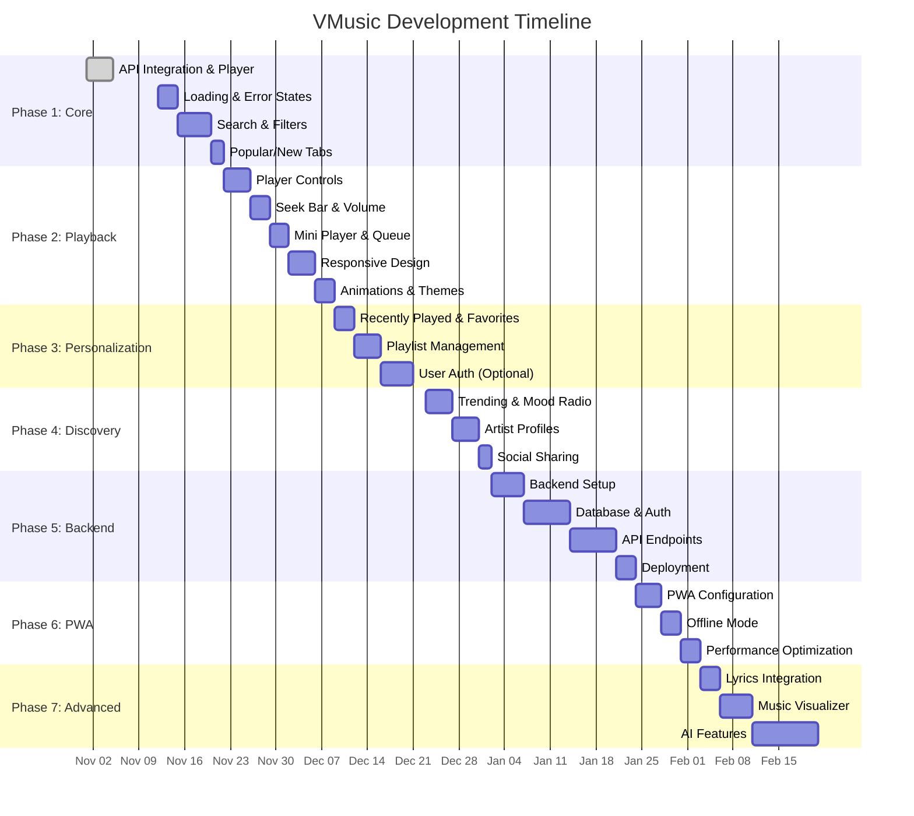

# 🎵 VMusic Development Roadmap

> **"Feel the Indie Beat. Free. Forever."**

A comprehensive development plan for building VMusic — a professional-grade music streaming web app for indie/royalty-free music using React + Vite + Tailwind CSS + Jamendo API.

---

## 📊 Feature Tracker Table

| Feature                                   | Phase | Priority | Difficulty | Impact (1-10) | Est. Time | Status  | Dependencies |
| ----------------------------------------- | ----- | -------- | ---------- | ------------- | --------- | ------- | ------------ |
| **Core Foundation**                       |
| Jamendo API Integration                   | 1     | High     | Easy       | 10            | 2 days    | ✅ Done | -            |
| Basic Player (Play/Pause)                 | 1     | High     | Easy       | 10            | 2 days    | ✅ Done | API          |
| Song Metadata Display                     | 1     | High     | Easy       | 9             | 1 day     | ✅ Done | API          |
| Loading States & Skeletons                | 1     | High     | Easy       | 8             | 2 days    | ⏳ Todo | -            |
| Error Handling & Fallbacks                | 1     | High     | Easy       | 8             | 1 day     | ⏳ Todo | -            |
| Search Functionality                      | 1     | High     | Medium     | 9             | 3 days    | ⏳ Todo | API          |
| Genre/Mood Filters                        | 1     | High     | Medium     | 8             | 3 days    | ⏳ Todo | API          |
| Popular/New Release Tabs                  | 1     | Medium   | Easy       | 7             | 2 days    | ⏳ Todo | API          |
| **Playback Experience**                   |
| Next/Previous Track Controls              | 2     | High     | Easy       | 9             | 2 days    | ⏳ Todo | Player       |
| Seek Bar (Progress + Time)                | 2     | High     | Medium     | 9             | 3 days    | ⏳ Todo | Player       |
| Volume Slider                             | 2     | High     | Easy       | 7             | 2 days    | ⏳ Todo | Player       |
| Shuffle & Repeat Modes                    | 2     | Medium   | Medium     | 6             | 2 days    | ⏳ Todo | Player       |
| Mini Floating Player                      | 2     | Medium   | Medium     | 8             | 3 days    | ⏳ Todo | Player       |
| Keyboard Shortcuts                        | 2     | Low      | Easy       | 5             | 1 day     | ⏳ Todo | Player       |
| **UI/UX Polish**                          |
| Responsive Design (Mobile/Tablet/Desktop) | 2     | High     | Medium     | 10            | 4 days    | ⏳ Todo | -            |
| Smooth Animations (Framer Motion)         | 2     | Medium   | Medium     | 8             | 3 days    | ⏳ Todo | -            |
| Glassmorphism UI Design                   | 2     | Low      | Easy       | 7             | 2 days    | ⏳ Todo | Tailwind     |
| Dynamic Blurred Background                | 2     | Medium   | Medium     | 9             | 2 days    | ⏳ Todo | Album Art    |
| Dark/Light Mode Toggle                    | 2     | Medium   | Easy       | 8             | 2 days    | ⏳ Todo | Tailwind     |
| Album Art Fallback Images                 | 1     | Medium   | Easy       | 6             | 1 day     | ⏳ Todo | -            |
| **Personalization**                       |
| Recently Played (localStorage)            | 3     | High     | Easy       | 8             | 2 days    | ⏳ Todo | -            |
| Favorite/Like Songs (localStorage)        | 3     | High     | Easy       | 9             | 2 days    | ⏳ Todo | -            |
| Create & Manage Playlists                 | 3     | High     | Medium     | 9             | 4 days    | ⏳ Todo | Storage      |
| User Authentication (Optional)            | 3     | Low      | Hard       | 7             | 5 days    | ⏳ Todo | Backend      |
| Profile Settings Page                     | 3     | Low      | Easy       | 5             | 2 days    | ⏳ Todo | Auth         |
| **Discovery & Social**                    |
| Trending Songs Section                    | 4     | High     | Easy       | 8             | 2 days    | ⏳ Todo | API          |
| Mood-Based Radio (Chill/Focus/Workout)    | 4     | Medium   | Medium     | 8             | 3 days    | ⏳ Todo | API          |
| Artist Profile Pages                      | 4     | Medium   | Medium     | 7             | 4 days    | ⏳ Todo | API          |
| Share Song (Copy Link/Social)             | 4     | Low      | Easy       | 6             | 2 days    | ⏳ Todo | -            |
| Related Artists/Songs                     | 4     | Low      | Medium     | 6             | 3 days    | ⏳ Todo | API          |
| **Backend (Optional)**                    |
| Express.js / ASP.NET Core Setup           | 5     | Medium   | Medium     | 7             | 3 days    | ⏳ Todo | -            |
| MongoDB / PostgreSQL Integration          | 5     | Medium   | Medium     | 7             | 3 days    | ⏳ Todo | Backend      |
| User API (Signup/Login/JWT)               | 5     | Medium   | Hard       | 8             | 5 days    | ⏳ Todo | DB           |
| Playlists API (CRUD)                      | 5     | Medium   | Medium     | 8             | 3 days    | ⏳ Todo | DB, Auth     |
| Favorites API                             | 5     | Medium   | Easy       | 7             | 2 days    | ⏳ Todo | DB, Auth     |
| Listening History API                     | 5     | Low      | Easy       | 6             | 2 days    | ⏳ Todo | DB, Auth     |
| **Advanced Features**                     |
| PWA Support (Installable)                 | 6     | Medium   | Medium     | 8             | 3 days    | ⏳ Todo | Vite Config  |
| Offline Mode (Service Workers)            | 6     | Low      | Hard       | 6             | 5 days    | ⏳ Todo | PWA          |
| Music Visualizer (Web Audio API)          | 7     | Low      | Hard       | 7             | 5 days    | ⏳ Todo | Player       |
| Lyrics Integration (Lyrics.ovh)           | 7     | Low      | Medium     | 7             | 3 days    | ⏳ Todo | API          |
| AI Mood Playlist Generator                | 7     | Low      | Hard       | 8             | 7 days    | ⏳ Todo | Backend, AI  |
| Recommendation System                     | 7     | Low      | Hard       | 8             | 7 days    | ⏳ Todo | Backend, ML  |
| Queue Management                          | 2     | Medium   | Medium     | 8             | 3 days    | ⏳ Todo | Player       |
| Crossfade Between Songs                   | 7     | Low      | Hard       | 5             | 4 days    | ⏳ Todo | Player       |

**Legend:**

- ✅ Done | ⏳ Todo | 🚧 In Progress | ❌ Blocked

---

## 🗓️ Phase-by-Phase Roadmap

### **PHASE 1: Core Foundation (Week 1-2)** ⏱️ ~2 weeks

**Goal:** Build a solid, working music player with API integration and basic discovery.

**Features:**

- ✅ Jamendo API integration with real songs
- ✅ Basic play/pause functionality
- ✅ Song metadata display (title, artist, album art)
- ⏳ Loading states with shimmer/skeleton UI
- ⏳ Error handling with user-friendly messages
- ⏳ Search bar for songs/artists/albums
- ⏳ Genre/mood/tag filters (Rock, Jazz, Chill, etc.)
- ⏳ Popular & New Releases tabs

**Tech Tasks:**

- Set up Vite + React + Tailwind CSS ✅
- Create reusable UI components (SongCard, SearchBar, FilterChips)
- Implement Jamendo API service layer with error handling
- Add loading skeletons using Tailwind animations

**Deliverables:**

- Functional search + browse + play experience
- Clean, modern UI with proper loading/error states

---

### **PHASE 2: Enhanced Playback & UI Polish (Week 3-4)** ⏱️ ~2 weeks

**Goal:** Make the player feel professional, smooth, and delightful.

**Features:**

- Next/Previous track controls
- Seek bar with current time / total duration
- Volume slider with mute toggle
- Shuffle & Repeat modes
- Mini floating player (stays visible while browsing)
- Queue management (view/reorder upcoming songs)
- Keyboard shortcuts (Spacebar = play/pause, Arrow keys = seek)
- Responsive design (mobile, tablet, desktop)
- Smooth animations using Framer Motion
- Dynamic blurred background using current album art
- Dark/Light mode toggle

**Tech Tasks:**

- Build custom Audio Player hook with full controls
- Implement Framer Motion for page transitions & animations
- Add Tailwind dark mode with `darkMode: 'class'`
- Create responsive layouts with mobile-first approach
- Optimize performance (lazy loading, code splitting)

**Deliverables:**

- Fully functional player with all standard controls
- Beautiful, responsive UI with smooth animations
- Both dark and light themes

---

### **PHASE 3: Personalization (Week 5-6)** ⏱️ ~2-3 weeks

**Goal:** Let users save preferences and create their own music collections.

**Features:**

- Recently Played history (last 20-30 songs)
- Favorite/Like songs with heart icon
- Create custom playlists
- Rename/delete playlists
- Add/remove songs from playlists
- Optional: User authentication (Firebase Auth or custom JWT)
- Optional: Profile settings page

**Tech Tasks:**

- Implement localStorage for favorites, history, playlists
- Create Context/Redux for global state management
- Build playlist management UI (modal/sidebar)
- Optional: Integrate Firebase Auth or build custom auth system
- Sync data to backend if auth is added

**Deliverables:**

- Users can save and organize their favorite music
- Persistent state across sessions (localStorage or DB)
- Optional login/signup flow

---

### **PHASE 4: Discovery & Social Features (Week 7-8)** ⏱️ ~2-3 weeks

**Goal:** Help users discover new music and share their favorites.

**Features:**

- Trending songs section (by popularity)
- Mood-based radio stations (Chill, Focus, Workout, Party, Romantic)
- Artist profile pages (bio, albums, top tracks)
- Related artists/songs recommendations
- Share song via copy link, WhatsApp, Twitter, Facebook
- "New This Week" section
- "Staff Picks" or curated playlists

**Tech Tasks:**

- Use Jamendo API filters: `order=popularity_total`, `datecreated`, `tags`
- Build artist page component with dynamic routing
- Implement Web Share API for mobile sharing
- Create curated mood playlists (manual or API-based)

**Deliverables:**

- Rich discovery experience with multiple browse options
- Artist pages with full discography
- Easy social sharing

---

### **PHASE 5: Backend Expansion (Week 9-12)** ⏱️ ~4 weeks (Optional)

**Goal:** Add persistence, user accounts, and scalable data storage.

**Features:**

- Backend API with Express.js or ASP.NET Core
- Database (MongoDB or PostgreSQL)
- User authentication (JWT + OAuth2)
- CRUD endpoints:
  - `/api/auth/signup`, `/api/auth/login`
  - `/api/playlists` (create, read, update, delete)
  - `/api/favorites` (add/remove liked songs)
  - `/api/history` (recently played tracks)
- Sync localStorage data to cloud for logged-in users

**Tech Tasks:**

- Set up Node.js/Express or ASP.NET Core backend
- Connect to MongoDB Atlas or PostgreSQL
- Implement JWT token authentication
- Create RESTful API endpoints
- Add API rate limiting & security (CORS, helmet, etc.)
- Deploy backend to Render, Railway, or Fly.io

**Deliverables:**

- Fully functional backend API
- User accounts with cloud sync
- Secure authentication system

---

### **PHASE 6: PWA & Performance Optimization (Week 13-14)** ⏱️ ~2 weeks

**Goal:** Make VMusic installable and lightning-fast.

**Features:**

- Progressive Web App (PWA) support
- Installable app icon (Add to Home Screen)
- Offline mode with service workers
- Cache songs for offline playback
- Performance optimizations:
  - Image lazy loading
  - Code splitting
  - Asset compression
  - CDN integration

**Tech Tasks:**

- Add Vite PWA plugin (`vite-plugin-pwa`)
- Create `manifest.json` with app icons
- Implement service worker for offline caching
- Optimize bundle size with tree-shaking
- Add image optimization (WebP format)
- Set up Vercel/Netlify for edge caching

**Deliverables:**

- Installable PWA on mobile & desktop
- Fast load times (<2s initial load)
- Offline playback capability

---

### **PHASE 7: Smart Add-ons & AI Features (Week 15+)** ⏱️ Ongoing

**Goal:** Differentiate VMusic with unique, cutting-edge features.

**Features:**

- **Lyrics Integration:** Display synced lyrics using Lyrics.ovh or Musixmatch API
- **Music Visualizer:** Real-time frequency bars using Web Audio API
- **AI Mood Playlist:** Generate playlists from text prompts ("Relaxing jazz for study")
- **Smart Recommendations:** "Because you liked X, here's Y" using collaborative filtering
- **Crossfade:** Smooth transitions between songs
- **Equalizer:** Custom audio EQ settings (Bass, Treble, etc.)

**Tech Tasks:**

- Integrate lyrics API with search/sync
- Build audio visualizer with Canvas/WebGL
- Optional: Add AI backend (OpenAI API or local model)
- Implement recommendation algorithm (content-based or collaborative)
- Use Web Audio API for advanced audio features

**Deliverables:**

- Unique features that set VMusic apart from competitors
- AI-powered music discovery
- Pro-level audio controls

---

## 📅 Gantt Timeline (Visual Schedule)



---

## 📁 Suggested Folder Structure

```
VMusic/
├── public/
│   ├── icons/                    # PWA icons (192x192, 512x512)
│   ├── manifest.json             # PWA manifest
│   └── favicon.ico
│
├── src/
│   ├── api/                      # API integration layer
│   │   ├── jamendo.js            # Jamendo API service
│   │   ├── lyrics.js             # Lyrics API (optional)
│   │   └── backend.js            # Custom backend API (if added)
│   │
│   ├── assets/                   # Static assets
│   │   ├── images/               # Logos, placeholders, icons
│   │   └── sounds/               # UI sound effects (optional)
│   │
│   ├── components/               # Reusable UI components
│   │   ├── common/               # Generic components
│   │   │   ├── Button.jsx
│   │   │   ├── Card.jsx
│   │   │   ├── Input.jsx
│   │   │   ├── Modal.jsx
│   │   │   ├── Skeleton.jsx
│   │   │   └── Toast.jsx
│   │   │
│   │   ├── layout/               # Layout components
│   │   │   ├── Navbar.jsx
│   │   │   ├── Sidebar.jsx
│   │   │   ├── Footer.jsx
│   │   │   └── Layout.jsx
│   │   │
│   │   ├── player/               # Music player components
│   │   │   ├── Player.jsx        # Main player container
│   │   │   ├── MiniPlayer.jsx    # Floating mini player
│   │   │   ├── Controls.jsx      # Play/pause/next/prev
│   │   │   ├── SeekBar.jsx       # Progress bar
│   │   │   ├── VolumeSlider.jsx
│   │   │   ├── Queue.jsx         # Queue sidebar
│   │   │   └── Visualizer.jsx    # Audio visualizer (optional)
│   │   │
│   │   ├── music/                # Music-specific components
│   │   │   ├── SongCard.jsx      # Single song item
│   │   │   ├── SongList.jsx      # List of songs
│   │   │   ├── AlbumCard.jsx
│   │   │   ├── ArtistCard.jsx
│   │   │   └── PlaylistCard.jsx
│   │   │
│   │   ├── search/               # Search components
│   │   │   ├── SearchBar.jsx
│   │   │   ├── SearchResults.jsx
│   │   │   └── FilterChips.jsx   # Genre/mood filters
│   │   │
│   │   └── features/             # Feature-specific components
│   │       ├── Favorites.jsx
│   │       ├── RecentlyPlayed.jsx
│   │       ├── Playlists.jsx
│   │       ├── MoodRadio.jsx
│   │       └── Trending.jsx
│   │
│   ├── hooks/                    # Custom React hooks
│   │   ├── useAudioPlayer.js     # Audio player logic
│   │   ├── useSearch.js          # Search functionality
│   │   ├── useFavorites.js       # Favorites management
│   │   ├── usePlaylist.js        # Playlist operations
│   │   ├── useLocalStorage.js    # localStorage utilities
│   │   ├── useTheme.js           # Dark/light mode
│   │   └── useKeyboardShortcuts.js
│   │
│   ├── context/                  # React Context providers
│   │   ├── AudioContext.jsx      # Global audio state
│   │   ├── ThemeContext.jsx      # Theme state
│   │   ├── AuthContext.jsx       # User authentication (optional)
│   │   └── PlaylistContext.jsx   # Playlists state
│   │
│   ├── pages/                    # Route pages
│   │   ├── Home.jsx              # Landing page
│   │   ├── Browse.jsx            # Browse all songs
│   │   ├── Search.jsx            # Search results page
│   │   ├── Artist.jsx            # Artist profile page
│   │   ├── Playlist.jsx          # Playlist detail page
│   │   ├── Favorites.jsx         # User's favorites
│   │   ├── Library.jsx           # User's library (playlists + favorites)
│   │   ├── Discover.jsx          # Trending/mood radios
│   │   ├── Profile.jsx           # User profile (if auth added)
│   │   └── NotFound.jsx          # 404 page
│   │
│   ├── styles/                   # Global styles
│   │   ├── index.css             # Tailwind imports + global styles
│   │   ├── animations.css        # Custom animations
│   │   └── themes.css            # Dark/light theme variables
│   │
│   ├── utils/                    # Utility functions
│   │   ├── formatTime.js         # Format seconds to MM:SS
│   │   ├── shuffleArray.js       # Shuffle songs
│   │   ├── storage.js            # localStorage helpers
│   │   ├── constants.js          # App constants (API keys, URLs)
│   │   └── validators.js         # Input validation
│   │
│   ├── App.jsx                   # Main app component
│   ├── main.jsx                  # Entry point
│   └── router.jsx                # React Router setup
│
├── .env.example                  # Environment variables template
├── .gitignore
├── eslint.config.js
├── index.html
├── package.json
├── postcss.config.cjs
├── tailwind.config.cjs
├── vite.config.js
└── README.md
```

---

## 🎨 Component Breakdown

### **1. Layout Components**

#### `Navbar.jsx`

- Logo + App name
- Search bar (global)
- Dark/light mode toggle
- User profile icon (if auth enabled)
- Navigation links (Home, Browse, Library, Discover)

#### `Sidebar.jsx`

- Navigation menu (Home, Search, Library)
- Recently Played section
- My Playlists
- Favorites
- Collapsible on mobile

#### `Footer.jsx` / `Player.jsx`

- Fixed bottom player bar
- Album art thumbnail
- Song info (title, artist)
- Playback controls (prev, play/pause, next)
- Seek bar
- Volume control
- Queue button
- Fullscreen player button

---

### **2. Player Components**

#### `Player.jsx` (Main Player)

```jsx
<Player>
  <PlayerArt /> {/* Large album art with blur effect */}
  <SongInfo /> {/* Title, artist, album */}
  <Controls /> {/* Play/pause, next, prev, shuffle, repeat */}
  <SeekBar /> {/* Progress bar + time stamps */}
  <VolumeSlider /> {/* Volume control */}
  <ActionButtons /> {/* Like, add to playlist, share */}
  <Visualizer /> {/* Optional: audio visualizer */}
</Player>
```

#### `MiniPlayer.jsx`

- Compact floating player (stays visible on all pages)
- Shows current song
- Basic play/pause control
- Expands to full player on click

---

### **3. Music Components**

#### `SongCard.jsx`

```jsx
Props: { song, onPlay, onLike, showAlbum }
- Album art image
- Song title
- Artist name
- Duration
- Play button overlay on hover
- Heart icon (favorite)
- Three-dot menu (add to playlist, share)
```

#### `SongList.jsx`

```jsx
Props: { songs, currentSong, onSongSelect }
- Table/list view of songs
- Columns: #, Title, Artist, Album, Duration
- Highlight currently playing song
- Play on row click
```

---

### **4. Search & Filter Components**

#### `SearchBar.jsx`

```jsx
Props: { onSearch, placeholder }
- Input field with icon
- Debounced search (wait 300ms)
- Clear button
- Recent searches dropdown
```

#### `FilterChips.jsx`

```jsx
Props: { filters, activeFilter, onFilterChange }
- Genre chips (Rock, Pop, Jazz, Electronic, etc.)
- Mood chips (Chill, Focus, Workout, Party)
- Active state styling
- Horizontal scrollable on mobile
```

---

### **5. Feature Components**

#### `Playlists.jsx`

```jsx
- Grid of playlist cards
- "Create New Playlist" button
- Each card shows:
  - Playlist cover (first 4 album arts)
  - Playlist name
  - Song count
  - Edit/delete buttons
```

#### `MoodRadio.jsx`

```jsx
Props: { mood }
- Large mood cards (Chill, Focus, Workout, etc.)
- Gradient backgrounds
- Play button
- Auto-generates playlist based on mood tags
```

---

## 🎯 UI/UX Best Practices

### **Design Principles**

1. **Minimalism:** Clean, uncluttered interface
2. **Accessibility:** WCAG 2.1 AA compliant (keyboard nav, ARIA labels)
3. **Consistency:** Uniform spacing, colors, typography
4. **Feedback:** Loading states, success/error toasts, hover effects
5. **Performance:** Lazy loading, optimized images, code splitting

### **Color Palette (Suggested)**

```css
/* Dark Mode */
--bg-primary: #0a0a0a;
--bg-secondary: #1a1a1a;
--bg-tertiary: #2a2a2a;
--text-primary: #ffffff;
--text-secondary: #b3b3b3;
--accent: #1db954; /* Spotify green */
--accent-hover: #1ed760;

/* Light Mode */
--bg-primary: #ffffff;
--bg-secondary: #f5f5f5;
--bg-tertiary: #e5e5e5;
--text-primary: #000000;
--text-secondary: #606060;
--accent: #1db954;
--accent-hover: #1ed760;
```

### **Typography**

- **Headings:** Inter, Poppins, or Montserrat (bold, modern)
- **Body:** System fonts for performance
- **Scale:** 12px, 14px, 16px, 20px, 24px, 32px, 48px

### **Spacing System**

- Use Tailwind's spacing scale: 4px increments (0, 1, 2, 3, 4, 6, 8, 12, 16, 20, 24, 32, 40, 48, 64)

---

## 🚀 Technical Implementation Guide

### **1. Jamendo API Integration**

```javascript
// src/api/jamendo.js
const CLIENT_ID = import.meta.env.VITE_JAMENDO_CLIENT_ID;
const BASE_URL = 'https://api.jamendo.com/v3.0';

export const jamendoAPI = {
  // Search songs
  searchTracks: async (query, limit = 20) => {
    const response = await fetch(
      `${BASE_URL}/tracks/?client_id=${CLIENT_ID}&search=${query}&limit=${limit}&format=json&audioformat=mp32`
    );
    return response.json();
  },

  // Get tracks by genre
  getTracksByGenre: async (genre, limit = 20) => {
    const response = await fetch(
      `${BASE_URL}/tracks/?client_id=${CLIENT_ID}&tags=${genre}&limit=${limit}&format=json&audioformat=mp32`
    );
    return response.json();
  },

  // Get popular tracks
  getPopularTracks: async (limit = 20) => {
    const response = await fetch(
      `${BASE_URL}/tracks/?client_id=${CLIENT_ID}&order=popularity_total&limit=${limit}&format=json&audioformat=mp32`
    );
    return response.json();
  },

  // Get new releases
  getNewReleases: async (limit = 20) => {
    const response = await fetch(
      `${BASE_URL}/tracks/?client_id=${CLIENT_ID}&order=releasedate_desc&limit=${limit}&format=json&audioformat=mp32`
    );
    return response.json();
  },

  // Get artist info
  getArtist: async (artistId) => {
    const response = await fetch(
      `${BASE_URL}/artists/?client_id=${CLIENT_ID}&id=${artistId}&format=json`
    );
    return response.json();
  },

  // Get artist tracks
  getArtistTracks: async (artistId, limit = 20) => {
    const response = await fetch(
      `${BASE_URL}/tracks/?client_id=${CLIENT_ID}&artist_id=${artistId}&limit=${limit}&format=json&audioformat=mp32`
    );
    return response.json();
  },
};
```

### **2. Custom Audio Player Hook**

```javascript
// src/hooks/useAudioPlayer.js
import { useState, useRef, useEffect } from 'react';

export const useAudioPlayer = () => {
  const audioRef = useRef(new Audio());
  const [isPlaying, setIsPlaying] = useState(false);
  const [currentTime, setCurrentTime] = useState(0);
  const [duration, setDuration] = useState(0);
  const [volume, setVolume] = useState(1);
  const [currentSong, setCurrentSong] = useState(null);
  const [queue, setQueue] = useState([]);
  const [currentIndex, setCurrentIndex] = useState(0);
  const [shuffle, setShuffle] = useState(false);
  const [repeat, setRepeat] = useState('off'); // 'off', 'one', 'all'

  // Play/pause
  const togglePlay = () => {
    if (isPlaying) {
      audioRef.current.pause();
    } else {
      audioRef.current.play();
    }
    setIsPlaying(!isPlaying);
  };

  // Play specific song
  const playSong = (song) => {
    audioRef.current.src = song.audio;
    audioRef.current.play();
    setCurrentSong(song);
    setIsPlaying(true);
  };

  // Next/previous
  const playNext = () => {
    let nextIndex = currentIndex + 1;
    if (shuffle) {
      nextIndex = Math.floor(Math.random() * queue.length);
    }
    if (nextIndex >= queue.length) {
      nextIndex = repeat === 'all' ? 0 : currentIndex;
    }
    setCurrentIndex(nextIndex);
    playSong(queue[nextIndex]);
  };

  const playPrevious = () => {
    const prevIndex = currentIndex - 1 >= 0 ? currentIndex - 1 : queue.length - 1;
    setCurrentIndex(prevIndex);
    playSong(queue[prevIndex]);
  };

  // Seek
  const seek = (time) => {
    audioRef.current.currentTime = time;
    setCurrentTime(time);
  };

  // Volume
  const changeVolume = (vol) => {
    audioRef.current.volume = vol;
    setVolume(vol);
  };

  // Event listeners
  useEffect(() => {
    const audio = audioRef.current;

    const handleTimeUpdate = () => setCurrentTime(audio.currentTime);
    const handleLoadedMetadata = () => setDuration(audio.duration);
    const handleEnded = () => {
      if (repeat === 'one') {
        audio.play();
      } else {
        playNext();
      }
    };

    audio.addEventListener('timeupdate', handleTimeUpdate);
    audio.addEventListener('loadedmetadata', handleLoadedMetadata);
    audio.addEventListener('ended', handleEnded);

    return () => {
      audio.removeEventListener('timeupdate', handleTimeUpdate);
      audio.removeEventListener('loadedmetadata', handleLoadedMetadata);
      audio.removeEventListener('ended', handleEnded);
    };
  }, [repeat, currentIndex, queue]);

  return {
    isPlaying,
    currentTime,
    duration,
    volume,
    currentSong,
    queue,
    shuffle,
    repeat,
    togglePlay,
    playSong,
    playNext,
    playPrevious,
    seek,
    changeVolume,
    setShuffle,
    setRepeat,
    setQueue,
  };
};
```

### **3. Framer Motion Animations**

```javascript
// src/components/SongCard.jsx
import { motion } from 'framer-motion';

export const SongCard = ({ song, onPlay }) => {
  return (
    <motion.div
      className="song-card"
      initial={{ opacity: 0, y: 20 }}
      animate={{ opacity: 1, y: 0 }}
      whileHover={{ scale: 1.05 }}
      whileTap={{ scale: 0.95 }}
      transition={{ duration: 0.2 }}
    >
      
      <h3>{song.name}</h3>
      <p>{song.artist_name}</p>
      <button onClick={() => onPlay(song)}>Play</button>
    </motion.div>
  );
};
```

### **4. Dark Mode with Tailwind**

```javascript
// tailwind.config.cjs
module.exports = {
  darkMode: 'class', // Enable class-based dark mode
  content: ['./index.html', './src/**/*.{js,jsx,ts,tsx}'],
  theme: {
    extend: {
      colors: {
        primary: {
          DEFAULT: '#1db954',
          dark: '#1ed760',
        },
        background: {
          light: '#ffffff',
          dark: '#0a0a0a',
        },
      },
    },
  },
};
```

```javascript
// src/hooks/useTheme.js
import { useState, useEffect } from 'react';

export const useTheme = () => {
  const [theme, setTheme] = useState(localStorage.getItem('theme') || 'dark');

  useEffect(() => {
    const root = document.documentElement;
    if (theme === 'dark') {
      root.classList.add('dark');
    } else {
      root.classList.remove('dark');
    }
    localStorage.setItem('theme', theme);
  }, [theme]);

  const toggleTheme = () => setTheme(theme === 'dark' ? 'light' : 'dark');

  return { theme, toggleTheme };
};
```

---

## 🔐 Security Best Practices

1. **Environment Variables:** Store API keys in `.env` files (never commit to Git)
2. **CORS:** Configure CORS properly for backend APIs
3. **Input Validation:** Sanitize all user inputs (search queries, playlist names)
4. **Rate Limiting:** Prevent API abuse with rate limiting
5. **JWT Security:** Use short-lived access tokens + refresh tokens
6. **HTTPS Only:** Always use HTTPS in production
7. **CSP Headers:** Content Security Policy to prevent XSS attacks

---

## 📊 Success Metrics (KPIs)

Track these metrics to measure VMusic's success:

1. **User Engagement:**
   - Daily/Monthly Active Users (DAU/MAU)
   - Average session duration
   - Songs played per session
   - Repeat visit rate

2. **Performance:**
   - Initial load time (<2s target)
   - Time to interactive (<3s target)
   - API response time (<500ms target)

3. **Feature Adoption:**
   - % users creating playlists
   - % users favoriting songs
   - Search usage rate
   - Dark/light mode preference split

4. **Technical Health:**
   - Error rate (<1% target)
   - API uptime (99.9% target)
   - Crash-free sessions (>99.5%)

---

## 🎨 5 Creative Taglines for VMusic

1. **"Feel the Indie Beat. Free. Forever."**
   - Emphasizes free, independent music with emotional connection

2. **"Your Soundtrack. Unlimited. Uncompromised."**
   - Highlights unlimited access with no restrictions

3. **"Music Without Borders. Discover the Unseen."**
   - Promotes discovery of indie/lesser-known artists

4. **"Where Sound Meets Freedom."**
   - Poetic, emphasizes freedom and quality

5. **"Unleash the Underground. Stream Without Limits."**
   - Targets users looking for alternative/indie music

**Bonus:**

- "Pure Music. Pure Joy. Zero Ads."
- "The Indie Music Revolution Starts Here."
- "Listen Different. Discover Better."

---

## 🎯 Next Immediate Steps

### **Week 1 Action Plan (Starting Nov 12, 2025)**

**Day 1-2: Setup & Infrastructure**

```bash
# Install dependencies
npm install tailwindcss @tailwindcss/vite autoprefixer -D
npm install framer-motion react-router-dom
npm install lucide-react  # For icons

# Create folder structure (see above)
# Set up Tailwind config with dark mode
# Create basic layout components (Navbar, Sidebar, Player)
```

**Day 3-4: API Integration**

- Complete Jamendo API service layer
- Add error handling & retries
- Test all API endpoints
- Create loading skeleton components

**Day 5-7: Search & Browse**

- Implement search bar with debouncing
- Add genre/mood filter chips
- Create Popular & New Releases tabs
- Build responsive song grid/list views

**Week 2: Polish & Testing**

- Add loading states everywhere
- Error boundaries for crash prevention
- Responsive design testing (mobile/tablet/desktop)
- Performance optimization (lazy loading, code splitting)

---

## 📚 Recommended Libraries

```json
{
  "dependencies": {
    "react": "^18.2.0",
    "react-dom": "^18.2.0",
    "react-router-dom": "^6.20.0",
    "framer-motion": "^10.16.0",
    "lucide-react": "^0.300.0",
    "zustand": "^4.4.0"
  },
  "devDependencies": {
    "@tailwindcss/vite": "^4.0.0",
    "tailwindcss": "^4.0.0",
    "autoprefixer": "^10.4.16",
    "vite": "^5.0.0",
    "vite-plugin-pwa": "^0.17.0"
  }
}
```

**Why these libraries?**

- **React Router:** Client-side routing for SPAs
- **Framer Motion:** Smooth, declarative animations
- **Lucide React:** Beautiful, customizable icons
- **Zustand:** Lightweight state management (alternative to Redux)
- **Vite PWA:** Easy PWA configuration

---

## 🎓 Learning Resources

### **React + Vite**

- [Vite Official Guide](https://vitejs.dev/guide/)
- [React Official Docs](https://react.dev/)

### **Tailwind CSS**

- [Tailwind CSS Docs](https://tailwindcss.com/docs)
- [Tailwind UI Components](https://tailwindui.com/)

### **Framer Motion**

- [Framer Motion Docs](https://www.framer.com/motion/)
- [Motion Layout Animations](https://www.framer.com/motion/layout-animations/)

### **Audio APIs**

- [Web Audio API MDN](https://developer.mozilla.org/en-US/docs/Web/API/Web_Audio_API)
- [HTML5 Audio Element](https://developer.mozilla.org/en-US/docs/Web/HTML/Element/audio)

### **PWA**

- [PWA Builder](https://www.pwabuilder.com/)
- [Vite PWA Plugin](https://vite-pwa-org.netlify.app/)

---

## ✅ Definition of Done (DoD)

For each feature to be considered "complete":

1. ✅ Feature works on desktop, tablet, and mobile
2. ✅ Dark and light modes both supported
3. ✅ Loading states implemented
4. ✅ Error handling in place
5. ✅ Accessible (keyboard navigation, ARIA labels)
6. ✅ Smooth animations (no jank)
7. ✅ Code reviewed and refactored
8. ✅ No console errors or warnings
9. ✅ Tested with real Jamendo API data
10. ✅ Deployed and verified in production

---

## 🚢 Deployment Strategy

### **Frontend Hosting (Free Tier)**

- **Vercel** (Recommended) — Best for Vite/React
- **Netlify** — Great CI/CD integration
- **Cloudflare Pages** — Fast global CDN

### **Backend Hosting (Free Tier)**

- **Render** — Easy Node.js deployment
- **Railway** — Great for databases + API
- **Fly.io** — Global edge deployment

### **Database Hosting (Free Tier)**

- **MongoDB Atlas** — 512MB free
- **Supabase** — PostgreSQL with real-time
- **PlanetScale** — Serverless MySQL

### **CI/CD Pipeline**

```yaml
# .github/workflows/deploy.yml
name: Deploy to Vercel
on:
  push:
    branches: [main]
jobs:
  deploy:
    runs-on: ubuntu-latest
    steps:
      - uses: actions/checkout@v3
      - uses: actions/setup-node@v3
      - run: npm ci
      - run: npm run build
      - uses: amondnet/vercel-action@v25
```

---

## 🎯 Final Thoughts

VMusic has the potential to become a **premier destination for indie music lovers**. By focusing on:

1. **User Experience:** Smooth, delightful, and intuitive
2. **Performance:** Fast load times and responsive interactions
3. **Discovery:** Help users find new music they'll love
4. **Community:** Build a platform where artists and listeners connect

You'll create something truly special. Start with Phase 1 to build a solid foundation, then iteratively add features based on user feedback.

**Remember:**

- 🚀 Launch early, iterate often
- 📊 Measure everything (analytics are key)
- 💬 Listen to user feedback
- 🎨 Keep the UI clean and focused
- ⚡ Performance is a feature, not an afterthought

---

**Ready to build?** Start with:

```bash
npm install tailwindcss @tailwindcss/vite autoprefixer -D
npm run dev
```

Then follow the Week 1 Action Plan above. Good luck! 🎵✨
